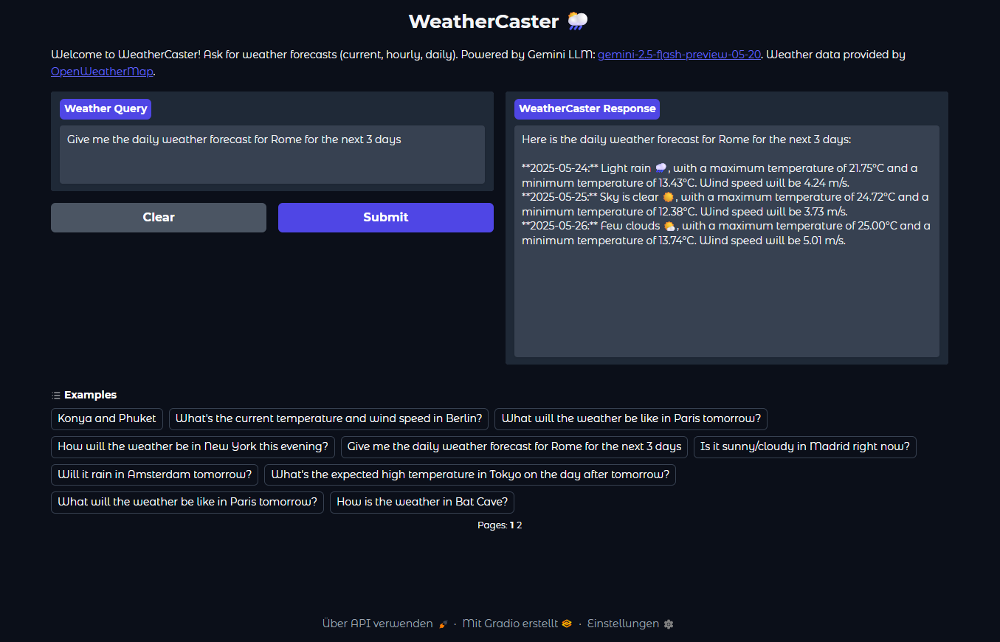

<h1 align="center"> WeatherCaster 🌦️: AI Weather Forecast Chatbot </h1>

<p align="center">
WeatherCaster is an AI-powered command-line chatbot that provides weather forecasts (current, hourly, and daily) using natural language queries. It leverages a local Large Language Model (LLM) via Ollama and fetches real-time weather data from the OpenWeatherMap API.
</p>

<p align="center">

</p>

This project was developed as part of the IU International University of Applied Sciences course:

**Project: AI Use Case (DLMAIPAIUC01)**.

**Author:** Yücel, Muhammed

## Table of Contents

- [Features](#features)
- [Tech Stack](#tech-stack)
- [Architecture Overview](#architecture-overview)
- [Setup and Installation](#setup-and-installation)
  - [Prerequisites](#prerequisites)
  - [Cloning the Repository](#cloning-the-repository)
  - [Environment Configuration (`.env`)](#environment-configuration-env)
  - [Installing Dependencies](#installing-dependencies)
- [Usage](#usage)
  - [CLI (Command-Line Interface)](#cli-command-line-interface)
  - [GUI (Graphical User Interface)](#gui-graphical-user-interface)
- [System Prompt](#system-prompt)

## Features

- **Natural Language Understanding:** Interprets user queries for locations and desired forecast types (current, today, tomorrow, hourly, daily).
- **Comprehensive Forecasts:**
    - Current weather conditions.
    - Hourly forecasts (for a configurable duration, e.g., next 24-96 hours).
    - Daily forecasts (for the next 16 days). 
- **Real-time Data:** Fetches up-to-date weather information using the OpenWeatherMap API.
- **Flexible LLM Backend:** Supports:
    - Locally hosted LLMs via Ollama (e.g., Llama 3.1, Mistral). 
    - External LLM providers like OpenAI and Google Gemini. 
- **Dual Interface:**
    - Command-Line Interface (CLI) for direct text-based interaction.
    - Web-based Graphical User Interface (GUI) built with Gradio for enhanced usability. 
- **Focused Interaction:** Designed to strictly provide weather-related information and guide users for valid queries, as defined in its system prompt.

## Tech Stack

- **Programming Language:** Python 3.12
- **AI Agent Framework:** [Pydantic-AI](https://github.com/pydantic/pydantic-ai)
- **LLM Integration:**
    - Local: [Ollama](https://ollama.com)
    - Cloud: OpenAI API, Google Gemini API
- **Web UI Framework:** [Gradio](https://gradio.app/)
- **Weather Data Provider:** [OpenWeatherMap API](https://openweathermap.org/api) (for Geocoding and Weather Forecasts)
- **Data Validation & Settings:** [Pydantic](https://docs.pydantic.dev/) (including `pydantic-settings`)
- **HTTP Requests:** `httpx` (used by WeatherAPIClient)
- **Asynchronous Operations:** `asyncio`

## Architecture Overview

The WeatherCaster chatbot operates through the following flow:
1.  The user enters a query via the Command-Line Interface (CLI) or the Gradio-based Graphical User Interface (GUI).
2.  The `WeatherCaster` agent, built with `Pydantic-AI` (from `src/application/weather_caster.py`), receives the query.
3.  The agent, guided by a detailed system prompt (`src/configs/agent_prompt.py`), uses the configured LLM (local via Ollama, or cloud-based like OpenAI/Gemini, as per `src/configs/config.py`) to understand the user's intent and determine if the `get_weather_forecast` tool is needed.
4.  If the tool is invoked, the `WeatherAPIClient` (`src/tools/weather_tools.py`) first uses the OpenWeatherMap Geocoding API to find coordinates for the specified location.
5.  It then calls the appropriate OpenWeatherMap weather forecast API endpoint based on the requested forecast type (current, hourly, daily).
6.  The API response is parsed and validated using Pydantic models (defined in `src/model_definition/`).
7.  The agent uses the structured weather data from the tool (or a direct textual response from the LLM for certain queries) to formulate a natural language response.
8.  The response is displayed to the user in the CLI or GUI.

<p align="center">

</p>

## Setup and Installation

### Prerequisites

- Python 3.12
- [UV](https://github.com/astral-sh/uv) (Python package installer and virtual environment manager, recommended)
- An OpenWeatherMap [API Key](https://openweathermap.org/appid)
- For local LLM usage:
    - [Ollama](https://ollama.com/download) installed and running.
    - Ensure you have pulled a model compatible with tool calling (e.g., `ollama pull llama3.1:latest` or `ollama pull qwen3:8b`).
- For cloud LLM usage:
    - An OpenAI [API Key](https://platform.openai.com/docs/) (if using OpenAI models).
    - A Google Gemini [API Key](https://ai.google.dev/gemini-api/docs) (if using Gemini models).

### Cloning the Repository

```bash
git clone MYCL94/WeatherCaster
cd WeatherCaster
```

# Environment Configuration (`.env`)

Before updating the environment variables, copy the `template.env` and rename it to `.env`.

### OpenWeatherMap API Key 
Get yours from https://openweathermap.org/appid
```
WEATHER_API_KEY="YOUR_OPENWEATHERMAP_API_KEY"
``` 

### LLM Configuration (Ollama)
```
# Choose ONE mode: Ollama (local), OpenAI, or Gemini by providing the relevant API key.
# The script will prioritize OpenAI, then Gemini, then Ollama based on key presence.

# Model ID (used for ALL providers: Ollama, OpenAI, Gemini)
# For Ollama: e.g., "llama3.1:latest", "qwen3:8b"
# For OpenAI: e.g., "gpt-4o", "gpt-4.1"
# For Gemini: e.g., "gemini-2.5-pro-preview-05-06", "gemini-pro"
MODEL_ID="llama3.1:latest" # << CHANGE THIS TO YOUR PREFERRED MODEL

# OpenAI API Key (Comment in/out as needed)
OPENAI_API_KEY="YOUR_OPENAI_API_KEY"

# Gemini API Key (Comment in/out as needed)
GEMINI_API_KEY="YOUR_GEMINI_API_KEY"

# Ollama Configuration (only used if no OpenAI or Gemini key is provided)
MODEL_HOST="http://localhost" # Host for Ollama
MODEL_PORT=11434            # Port for Ollama
```

### Installing Dependencies

```bash
uv venv --python 3.12
.venv\Scripts\activate

uv pip install -r pyproject.toml
```

### Usage

#### CLI (Command-Line Interface)
```bash
python src/cli.py

# Terminal Output
$ WeatherCaster Chatbot CLI
$ Type 'quit' or 'exit' to stop.
$ You:
```

alternatively

```bash
uv run weathercaster-cli

# Terminal Output
$ WeatherCaster Chatbot CLI
$ Type 'quit' or 'exit' to stop.
$ You:
```

#### GUI (Graphical User Interface)

To run the Gradio web interface:

```bash
python src/cli.py

# Terminal Output
$ Initializing WeatherCaster for Gradio UI...
$ WeatherCaster initialized successfully.
$ Launching WeatherCaster Gradio UI on http://127.0.0.1:7860 (or the next available port)...
$ Using local LLM: llama3.1:latest (via configured host/port)
$ Ensure your local LLM server (e.g., Ollama) is running and the model is available.
$ * Running on local URL:  http://0.0.0.0:7860

```

alternatively 

```
uv run weathercaster-gui

# Terminal Output
$ Initializing WeatherCaster for Gradio UI...
$ WeatherCaster initialized successfully.
$ Launching WeatherCaster Gradio UI on http://127.0.0.1:7860 (or the next available port)...
$ Using local LLM: llama3.1:latest (via configured host/port)
$ Ensure your local LLM server (e.g., Ollama) is running and the model is available.
$ * Running on local URL:  http://0.0.0.0:7860

```

## Usage

Enter your weather-related questions, for example:

* Berlin
* What's the weather in London tomorrow?
* Is it going to rain in New York this evening?
* Daily forecast for Paris next 3 days

Type quit or exit to stop the chatbot.

### System Prompt

The behavior and capabilities of the WeatherCaster agent are heavily defined by the system prompt located in src/agent_prompt.py. This prompt instructs the LLM on:

* Its persona ("WeatherCaster").
* Its sole capability: providing weather forecasts using the get_weather_forecast tool.
* How to interpret user queries for location and forecast type (current, hourly, daily, tomorrow).
* Specific response formatting and error handling.
* Strict limitations on answering non-weather-related questions.