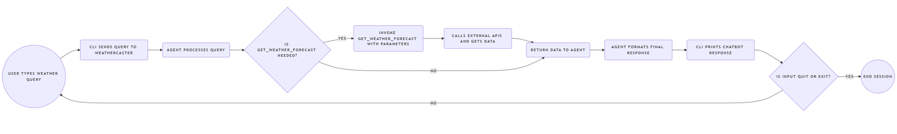

# WeatherCaster: AI Weather Forecast Chatbot

WeatherCaster is an AI-powered command-line chatbot that provides weather forecasts (current, hourly, and daily) using natural language queries. It leverages a local Large Language Model (LLM) via Ollama and fetches real-time weather data from the OpenWeatherMap API.

This project was developed as part of the IU International University of Applied Sciences course: 

**Project: AI Use Case (DLMAIPAIUC01)**.

**Author:** Yücel, Muhammed

## Table of Contents

- [Features](#features)
- [Tech Stack](#tech-stack)
- [Architecture Overview](#architecture-overview)
- [Project Structure](#project-structure)
- [Setup and Installation](#setup-and-installation)
  - [Prerequisites](#prerequisites)
  - [Cloning the Repository](#cloning-the-repository)
  - [Environment Configuration (`.env`)](#environment-configuration-env)
  - [Installing Dependencies](#installing-dependencies)
- [Usage](#usage)
- [System Prompt](#system-prompt)

## Features

- **Natural Language Understanding:** Interprets user queries for locations and desired forecast types (current, today, tomorrow, hourly, daily).
- **Comprehensive Forecasts:**
    - Current weather conditions.
    - Hourly forecasts (for the next 96 hours).
    - Daily forecasts (for the next 16 days).
- **Real-time Data:** Fetches up-to-date weather information using the OpenWeatherMap API.
- **Local LLM Powered:** Utilizes a locally hosted LLM via Ollama for query processing and response generation.
- **Focused Interaction:** Designed to strictly provide weather-related information and guide users for valid queries.
- **Command-Line Interface:** Simple and direct interaction through the terminal.

## Tech Stack

- **Programming Language:** Python 3.12
- **AI Agent Framework:** [Pydantic-AI](https://github.com/jxnl/pydantic-ai)
- **LLM Hosting:** [Ollama](https://ollama.com) (e.g., running Llama 3.1, Mistral, or other tool calling compatible models)
- **Weather Data Provider:** [OpenWeatherMap API](https://openweathermap.org/api) (for Geocoding and Weather Forecasts)
- **Data Validation & Settings:** [Pydantic](https://docs.pydantic.dev/) (including `pydantic-settings`)
- **HTTP Requests:** `requests` library
- **Asynchronous Operations:** `asyncio`

## Architecture Overview

The WeatherCaster chatbot operates through the following flow:
1.  The user enters a query via the Command-Line Interface (CLI).
2.  The `WeatherCaster` agent, built with `Pydantic-AI`, receives the query.
3.  The agent, guided by a detailed system prompt, uses the configured LLM (via Ollama) to understand the user's intent and determine if the `get_weather_forecast` tool is needed.
4.  If the tool is invoked, the `WeatherAPIClient` first uses the OpenWeatherMap Geocoding API to find coordinates for the specified location.
5.  It then calls the appropriate OpenWeatherMap weather forecast API endpoint based on the requested forecast type (current, hourly, daily).
6.  The API response is parsed and validated using Pydantic models.
7.  The agent uses the structured weather data from the tool to formulate a natural language response.
8.  The response is displayed to the user in the CLI.




## Setup and Installation

### Prerequisites

- Python 3.12
- OpenWeatherMap [API Key](https://openweathermap.org/appid)
- [Ollama](https://ollama.com/download) installed and running.
  - Ensure you have pulled a model compatible with the agent (e.g., `ollama pull llama3.1:latest` or `ollama pull mistral`). The model ID will be needed in the `.env` file.

### Cloning the Repository

```bash
git clone MYCL94/WeatherCaster
cd WeatherCaster
```

# Environment Configuration (`.env`)

Before updating the environment variables, copy the `template.env` and rename it to `.env`.

### Geocoding API Endpoint (OpenWeatherMap)
```
GEO_API="http://api.openweathermap.org/geo/1.0/direct"
```

### OpenWeatherMap API Key 
Get yours from https://openweathermap.org/appid
```
WEATHER_API_KEY="YOUR_OPENWEATHERMAP_API_KEY"
``` 

### OpenWeatherMap API Endpoints (as used by the application)
```
WEATHER_API_CURRENT="https://api.openweathermap.org/data/2.5/weather"
WEATHER_API_HOURLY="https://api.openweathermap.org/data/2.5/forecast
WEATHER_API_DAILY="https://api.openweathermap.org/data/2.5/forecast/daily
```

### LLM Configuration (Ollama)
```
MODEL_ID="llama3.1:latest" # Replace with your desired Ollama model ID (e.g., mistral:latest)
MODEL_HOST="http://localhost"
MODEL_PORT=11434
MODEL_API_KEY="ollama" # Currently a placeholder for Ollama's OpenAI-compatible endpoint
```

### Installing Dependencies

```bash
uv venv --python 3.12
.venv\Scripts\activate

uv pip install -r pyproject.toml
```

### Usage
```bash
python src/cli.py

# Terminal Output
$ WeatherCaster Chatbot CLI
$ Type 'quit' or 'exit' to stop.
$ You:
```

Alternatively

```bash
uv run weathercaster-cli

# Terminal Output
$ WeatherCaster Chatbot CLI
$ Type 'quit' or 'exit' to stop.
$ You:
```

Enter your weather-related questions, for example:

* Berlin
* What's the weather in London tomorrow?
* Is it going to rain in New York this evening?
* Daily forecast for Paris next 3 days

Type quit or exit to stop the chatbot.

### System Prompt

The behavior and capabilities of the WeatherCaster agent are heavily defined by the system prompt located in src/agent_prompt.py. This prompt instructs the LLM on:

Its persona ("WeatherCaster").
Its sole capability: providing weather forecasts using the get_weather_forecast tool.
How to interpret user queries for location and forecast type (current, hourly, daily, tomorrow).
Specific response formatting and error handling.
Strict limitations on answering non-weather-related questions.
